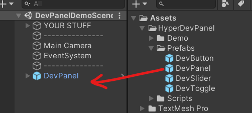
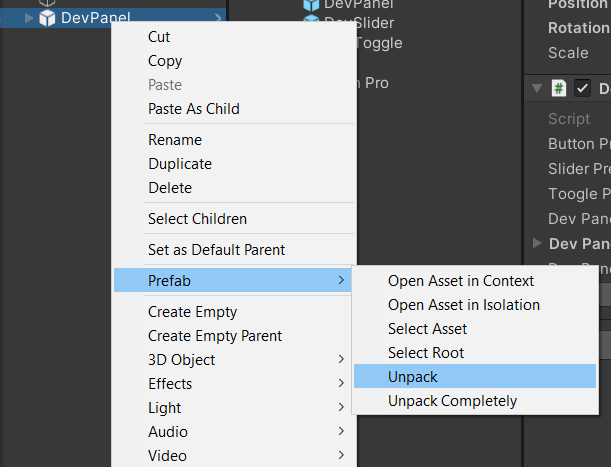
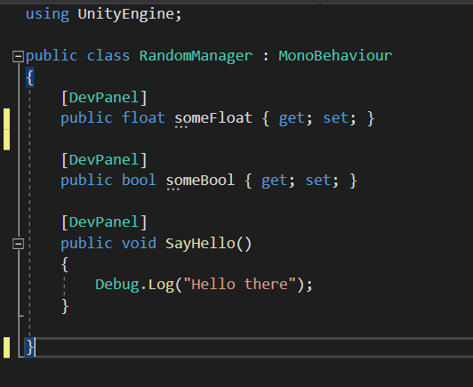
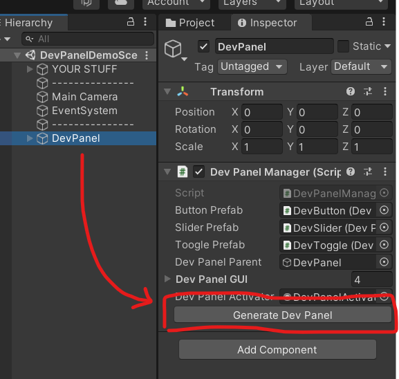
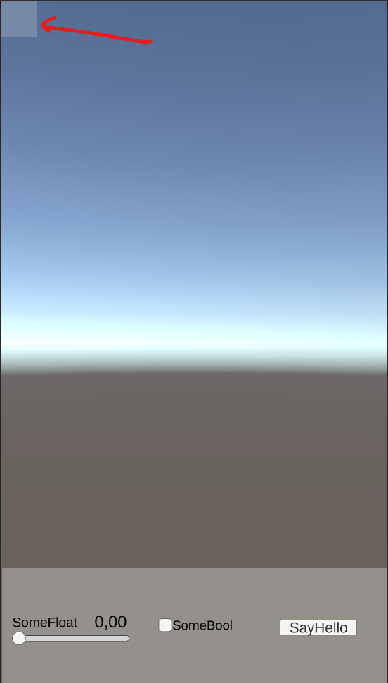

# HyperDevPanel
Simple attributes system to setup a devPanel seamlesly with your code in Unity.

Specially designed for fast prototypes workflow.

# Installation
Copy HyperDevPanel folder anywhere into your Assets folder.
Make sure you have **TextMeshPro** installed (just used for the UI prefabs).

# How to use it
| 1     | 2      | 3      | 4     | 5      |
|------------|-------------|-------------|-------------|-------------|
 |  |  |  |   |


## Step 1: Add Hyper Dev Panel prefab
Drag and drop the HyperDevPanel Prefab into your scene.
Then unpack the prefab.

## Step 2: Add [DevPanel] attribute
Add **[DevPanel]** attribute into your methods and attributes.

```
[DevPanel]
public bool someBool {get;set;}

[DevPanel]
public void SayHello(){}
```

Supported types:
  - float
  - bool
  - void methods
  
## Step 3: Play

Click on Update UI. And that's it!

You'll see a white button on the left side. That's used for activating and deactivating the panel on runtime.
