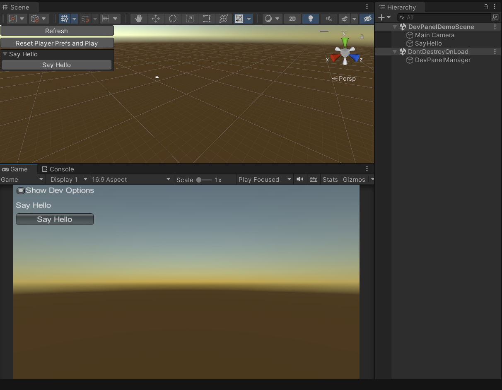
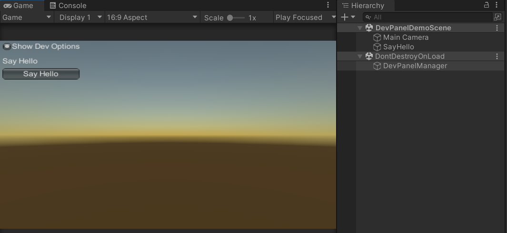

# HyperDevPanel

Add fast testing buttons to your prototype.

Specially designed for fast prototypes workflow.

 

# Installation

Copy HyperDevPanel folder anywhere into your Assets folder.

# How to use it

Extend any MonoBehaviour with the IDevTool interface:

```
using HyperDevTool;
using UnityEngine;

public class MyTool : MonoBehaviour, IDevTool
{

    //Draw your stuff using GUILayout API
    public void DrawOptions()
    {
        if (GUILayout.Button("Say Hello"))
        {
            Debug.Log("Say Hello");
        }
    }

    //Provide the name of the tool
    public string GetToolName()
    {
        return "Say Hello";
    }
}
```
That would show the option already in the scene as a custom tool.

If you want to preview the options on GameView add the DevPanelManager prefab:
 

For full reference on how GUILayout works:

[GUILayout Unity API Reference](https://docs.unity3d.com/ScriptReference/GUILayout.html)